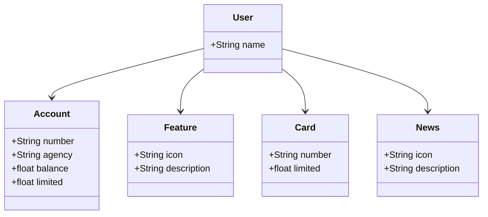

# API RESTful com Java 17, Spring Boot 3 e Spring Data JPA

Este projeto é uma API RESTful construída com Java 17, Spring Boot 3 e Spring Data JPA. A API também utiliza o OpenAPI (Swagger) para documentação e é implantada na plataforma Railway.

## Funcionalidades

- Criação de usuários
- Gerenciamento de contas bancárias
- Gerenciamento de recursos de cartões
- Listagem de novidades

## Estrutura do Projeto

## Tecnologias Utilizadas
- Java 17: A versão LTS mais recente do Java.
- Spring Boot 3: Framework que facilita a configuração e inicialização da aplicação.
- Spring Data JPA: Simplifica a integração com bancos de dados SQL.
- PostgreSQL: Banco de dados utilizado em produção.
- H2: Banco de dados em memória utilizado para desenvolvimento local.
- OpenAPI (Swagger): Utilizado para documentação da API.
- Railway: Plataforma para deploy na nuvem.
