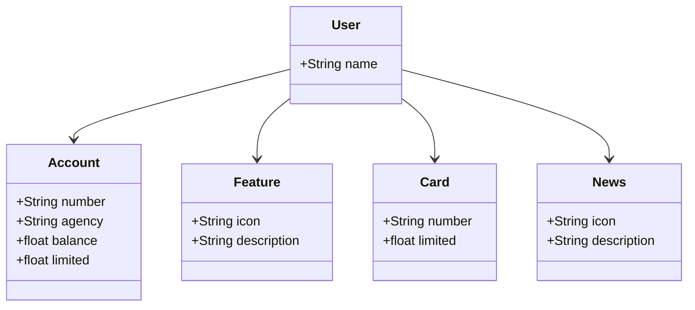

# API RESTful com Java 17, Spring Boot 3 e Spring Data JPA

Este projeto é uma API RESTful construída com Java 17, Spring Boot 3 e Spring Data JPA. A API também utiliza o OpenAPI (Swagger) para documentação e é implantada na plataforma Railway.

## Funcionalidades

- Criação de usuários
- Gerenciamento de contas bancárias
- Gerenciamento de recursos de cartões
- Listagem de novidades

## Estrutura do Projeto



## Tecnologias Utilizadas
- Java 17: A versão LTS mais recente do Java.
- Spring Boot 3: Framework que facilita a configuração e inicialização da aplicação.
- Spring Data JPA: Simplifica a integração com bancos de dados SQL.
- PostgreSQL: Banco de dados utilizado em produção e para desenvolvimento local.
- OpenAPI (Swagger): Utilizado para documentação da API.
- Railway: Plataforma para deploy na nuvem.

## Configuração para Deploy no Railway com Docker
Para implantar a aplicação no Railway, siga estes passos:
1. Configuração da Variável de Ambiente
    Na classe principal da sua aplicação Spring Boot, adicione uma variável global PORT, que deve ser inicializada com a variável de ambiente PORT do Railway. Exemplo:
   
   ``` java
   public static final String PORT = System.getenv().getOrDefault("PORT", "3000");
   
   ```

   No arquivo application.properties, defina a porta do servidor:

   ``` bash
   server.port=${PORT:3000}

   ```
2. Criação do Dockerfile
   Crie um arquivo Dockerfile na raiz do projeto com o seguinte conteúdo:

   ``` dockerfile
   FROM openjdk:17
   ADD target/docker-spring-boot.jar docker-spring-boot.jar
   ENTRYPOINT ["java", "-jar", "docker-spring-boot.jar"]
   ```
   Certifique-se de que o nome do arquivo JAR (docker-spring-boot.jar) corresponde ao nome configurado no Maven (<finalName>).
   
3. Compilação e Build da Aplicação
    Para construir a aplicação, execute os seguintes comandos Maven:

   ``` bash
   mvn clean
   mvn install
   ```
   Após o sucesso da build, copie o arquivo JAR gerado (como docker-spring-boot.jar após o build) para a raiz do projeto.
   
4. Deploy no Railway
   Finalmente, faça o deploy da aplicação para o Railway conforme as instruções fornecidas pela plataforma.
